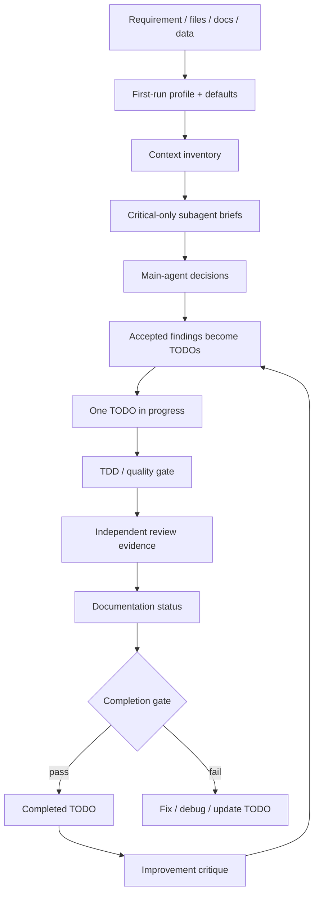

# review-driven-development

[](https://github.com/YOUR_GITHUB_USERNAME/review-driven-development/actions/workflows/ci.yml)
[](#requirements)
[](https://developers.openai.com/codex/skills)

## English

> A Codex custom skill for review-driven development: requirements → source/file analysis → critical subagents → TODOs → TDD validation → independent review → documentation → improvement loop.

한국어 문서는 [README.ko.md](README.ko.md)를 참고하세요.

## Why this exists

Codex can implement quickly, but complex research or engineering work often fails because the agent skips one of the boring parts: clarifying assumptions, reusing existing code safely, testing the actual TODO, recording review evidence, or updating documentation. `review-driven-development` packages those steps into a repeatable skill workflow.

The skill is intentionally conservative:

- It asks first-run questions and stores project defaults.
- It analyzes text, Markdown, source files, tests, and data files before planning.
- It uses critical-only subagents for debate, validation, and improvement.
- It executes one TODO at a time.
- It refuses to mark a TODO complete without validation evidence, independent review evidence, and documentation status.

## Features

| Area | What is included |
|---|---|
| Skill entrypoint | `skills/review-driven-development/SKILL.md` |
| Persistent state | `.codex/review-driven-development/profile.md`, `defaults.json`, ledgers |
| Requirement analysis | Language/method/code-reuse options with tradeoffs |
| Source/file analysis | Markdown, README, AGENTS.md, source, tests, build files, CSV/data files |
| Context cache | Bounded fingerprint cache, compact `context-pack.md`, semantic locator index, and repo-local bootstrap |
| Critical subagents | Pre-plan, validation, and improvement brief generation |
| TODO lifecycle | Append-only TODO ledger with one active TODO rule |
| Validation | Dry-run and executed quality-gate reports for test/lint/build/eval |
| Documentation gate | README/docs/ADR/changelog/implementation-log checks |
| External skill policy | Official/community skill URLs and trust policy |
| Tests | `self_test.py` and `pytest` smoke workflow tests |

## Repository layout

```text
.
├── README.md
├── README.ko.md
├── README.en.md
├── VALIDATION.md
├── REVIEW_NOTES.md
├── external-skills.json
├── skills/
│   └── review-driven-development/
│       ├── SKILL.md
│       ├── agents/openai.yaml
│       ├── references/
│       └── scripts/
├── tests/
│   └── test_smoke_workflow.py
├── docs/
│   └── github-setup.md
└── .github/
    ├── workflows/ci.yml
    ├── dependabot.yml
    ├── ISSUE_TEMPLATE/
    └── PULL_REQUEST_TEMPLATE.md
```

## Requirements

- Python 3.10+
- `pytest` for the test suite
- Codex environment that supports custom skills
- Optional: GitHub CLI (`gh`) if you use PR/comment workflows

Install test dependency locally:

```bash
python -m pip install -U pip pytest
```

For higher-accuracy semantic ranking, install optional ranking extras:

```bash
python -m pip install -e ".[semantic]"
python -m pip install -e ".[embeddings]"
# or both
python -m pip install -e ".[all]"
```

## Install as a Codex skill

### Option A: repository-local install

Use this when you want the skill to apply only to one repository.

```bash
mkdir -p .agents/skills
cp -R skills/review-driven-development .agents/skills/review-driven-development
python .agents/skills/review-driven-development/scripts/validate_skill.py \
  --skill-dir .agents/skills/review-driven-development
```

### Option B: user-local install

Use this when you want the skill available across repositories.

```bash
mkdir -p ~/.agents/skills
cp -R skills/review-driven-development ~/.agents/skills/review-driven-development
python ~/.agents/skills/review-driven-development/scripts/validate_skill.py \
  --skill-dir ~/.agents/skills/review-driven-development
```

### Option C: helper-based install

```bash
python skills/review-driven-development/scripts/skill_registration.py \
  --repo-root . \
  --scope repo \
  --overwrite
```

Then open Codex in the target repository and confirm the skill appears:

```text
/skills
```

Invoke it explicitly:

```text
Use $review-driven-development for this requirement.
```

## Quick start

Run the local validation suite first:

```bash
python -m compileall -q -f skills/review-driven-development/scripts
python skills/review-driven-development/scripts/validate_skill.py \
  --skill-dir skills/review-driven-development
python skills/review-driven-development/scripts/self_test.py
pytest -q
```

Expected result:

```text
validate_skill.py: ok True
self_test.py: ok true
pytest: 14 passed
```

Create project state:

```bash
python skills/review-driven-development/scripts/rdd_state.py --root . ensure
python skills/review-driven-development/scripts/rdd_state.py --root . init-defaults \
  --answers "English docs, Korean responses, TDD-first, review then reuse existing code"
```

Build or reuse a project inventory, cache, and compact context pack:

```bash
python skills/review-driven-development/scripts/context_inventory.py --root . --sync --summary
python skills/review-driven-development/scripts/context_inventory.py --root . --sync --overview
python skills/review-driven-development/scripts/context_inventory.py --root . --sync --semantic-summary
python skills/review-driven-development/scripts/context_inventory.py --root . --sync --semantic-search "quality gate completion"
python skills/review-driven-development/scripts/context_inventory.py --root . --sync --bootstrap
python skills/review-driven-development/scripts/workflow_runner.py --root . --phase commands
```

Create or start a TODO:

```bash
python skills/review-driven-development/scripts/todo_manager.py --root . create \
  "Add workflow smoke test" \
  --acceptance "pytest passes" \
  --risk medium

python skills/review-driven-development/scripts/todo_manager.py --root . start-next
```

Run quality gates:

```bash
python skills/review-driven-development/scripts/quality_gate.py \
  --root . \
  --todo-id RDD-T-00000001 \
  --kinds test,lint,build \
  --record-todo-evidence
```

For real execution, configure commands first:

```json
{
  "test": ["pytest -q"],
  "lint": [],
  "build": [],
  "eval": []
}
```

Save it to:

```text
.codex/review-driven-development/commands.json
```

Then run:

```bash
python skills/review-driven-development/scripts/quality_gate.py \
  --root . \
  --todo-id RDD-T-00000001 \
  --kinds test,lint,build \
  --execute \
  --record-todo-evidence
```

Record independent review and documentation status:

```bash
python skills/review-driven-development/scripts/todo_manager.py --root . review \
  RDD-T-00000001 \
  --summary "Independent validation completed; no blocker/high finding remains."

python skills/review-driven-development/scripts/todo_manager.py --root . docs \
  RDD-T-00000001 \
  updated \
  --target README.md \
  --target .codex/review-driven-development/implementation-log.md
```

Complete the TODO only after gates are satisfied:

```bash
python skills/review-driven-development/scripts/todo_manager.py --root . complete RDD-T-00000001
```

## How it works



### State files

The skill stores project-local state under:

```text
.codex/review-driven-development/
├── profile.md
├── defaults.json
├── todos.jsonl
├── critic-findings.jsonl
├── decision-log.md
├── review-ledger.md
├── implementation-log.md
├── context-inventory.json
├── context-cache.json
├── context-pack.md
├── context-semantic-index.json
└── validation-reports/
```

### Fast context reuse

The context layer follows the ECC-style idea of loading compact, relevant context before opening large files. `context_inventory.py --sync` fingerprints the project with path/size/mtime metadata, reuses a valid cache, and writes:

```text
.codex/review-driven-development/context-inventory.json
.codex/review-driven-development/context-cache.json
.codex/review-driven-development/context-pack.md
.codex/review-driven-development/context-semantic-index.json
```

Codex should read `context-pack.md` first, run `--semantic-search "<query>"` to rank likely files, then open only the source/docs referenced by the active TODO. `context-semantic-index.json` stores the bounded file/symbol/term corpus and optional embedding vectors. Default ranking uses `scikit-learn` TF-IDF when installed, then lexical overlap; add `--embeddings` only when dense `sentence-transformers` ranking is worth the model-load cost. `--sync --bootstrap` inserts a marker-managed `AGENTS.md` block so future Codex sessions see this policy automatically.

Default `self_test.py` avoids embedding model loading for CI stability. Run the heavier embedding smoke check explicitly:

```bash
python skills/review-driven-development/scripts/self_test.py --embeddings
```

Set `HF_TOKEN` for higher Hugging Face rate limits when using `--embeddings`. In offline or restricted environments use the default non-embedding path, `--force-tfidf`, or `--force-lexical`.

### Completion gate

A TODO cannot be completed unless these are true:

1. Acceptance criteria exist.
2. Validation evidence exists.
3. If real quality-gate commands are configured, passing executed evidence exists.
4. Independent review evidence exists.
5. Documentation status is `updated` or `not_needed`.
6. No unresolved blocker/high review finding remains.

## External skills

External skills are listed in:

```text
external-skills.json
skills/review-driven-development/references/external-skills.md
skills/review-driven-development/references/external-skill-links.md
```

Recommended priority:

1. Official OpenAI skills: `define-goal`, `gh-address-comments`, `openai-docs`
2. Engineering workflow skills: `source-driven-development`, `planning-and-task-breakdown`, `incremental-implementation`, `test-driven-development`, `code-review-and-quality`, `documentation-and-adrs`
3. Fallback to this repository's `references/` and `scripts/` if an external skill is unavailable

Community skills should be reviewed before enabling scripts, hooks, or permissions.

## GitHub setup

This repository includes GitHub-ready defaults:

```text
.github/workflows/ci.yml
.github/dependabot.yml
.github/PULL_REQUEST_TEMPLATE.md
.github/ISSUE_TEMPLATE/*.yml
.github/CODEOWNERS
CONTRIBUTING.md
SECURITY.md
SUPPORT.md
CODE_OF_CONDUCT.md
```

Before publishing, replace placeholders:

```bash
grep -R "YOUR_GITHUB_USERNAME" -n .
grep -R "@YOUR_GITHUB_USERNAME" -n .
```

Recommended topics:

```text
codex skill agentic-workflow tdd code-review automation developer-tools python
```

See [docs/github-setup.md](docs/github-setup.md) and [GITHUB_UPLOAD_CHECKLIST.md](GITHUB_UPLOAD_CHECKLIST.md).

## Development

```bash
python -m pip install -U pip pytest
python -m compileall -q -f skills/review-driven-development/scripts
python skills/review-driven-development/scripts/validate_skill.py --skill-dir skills/review-driven-development
python skills/review-driven-development/scripts/self_test.py
pytest -q
```

## Contributing

See [CONTRIBUTING.md](CONTRIBUTING.md). Keep changes small, preserve the critical-only subagent contract, and update tests when changing workflow gates.

## Security

See [SECURITY.md](SECURITY.md). Do not store secrets in `.codex/review-driven-development/` state files.

## License

No open-source license has been selected yet. Add a `LICENSE` file before publishing as an open-source project.


## 한국어

한국어 전체 문서는 [README.ko.md](README.ko.md)를 참고하세요. 이 프로젝트는 요구사항 분석, 비판 전용 subagent, TODO 단위 TDD 검증, 독립 review, 문서화를 반복하는 Codex custom skill입니다.
